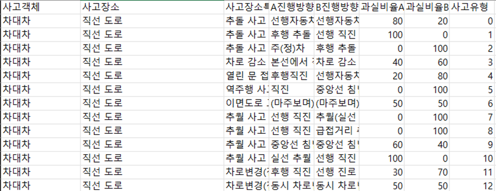

# 교통사고 판례 추천 API

이 프로젝트는 비디오 입력에서 사고 유형을 예측하고 예측된 사고 유형을 기반으로 사법 판례를 검색하는 API를 제공합니다.

## 기능

- **비디오 분류**: 사전 학습된 모델을 사용하여 비디오 입력에서 사고 유형을 분류합니다.
- **사법 판례 검색**: 예측된 사고 유형을 기반으로 로컬 네트워크 API를 호출하여 사법 판례를 검색합니다.

### 1. Data 준비

[AIHUB 교통사고 영상 데이터](https://aihub.or.kr/aihubdata/data/view.do?currMenu=&topMenu=&aihubDataSe=data&dataSetSn=597)

[데이터 설명서](vscode-local:/c%3A/Users/mu070/OneDrive/Documents/%EC%B9%B4%EC%B9%B4%EC%98%A4%ED%86%A1%20%EB%B0%9B%EC%9D%80%20%ED%8C%8C%EC%9D%BC/%EA%B5%90%ED%86%B5%EC%82%AC%EA%B3%A0_%EC%98%81%EC%83%81_%EB%8D%B0%EC%9D%B4%ED%84%B0_%EB%8D%B0%EC%9D%B4%ED%84%B0%EC%84%A4%EB%AA%85%EC%84%9C.csv)


### 2. 모델 준비

모델 구성 파일과 체크포인트 파일을 `work_dirs` 디렉토리에 배치합니다.

- [`my_custom_config_tsn.py`](https://drive.google.com/file/d/1G0boPGOqMkOS__Ka1QtUPegbeOTH9o7W/view?usp=drive_link)
- [`best_acc_top1_epoch_20.pth`](https://drive.google.com/file/d/15FHjHs0ov2SoLl0Vhgz53GmqUqj6E7c7/view?usp=sharing)

### 3. Docker 컨테이너 빌드 및 실행

```bash
docker-compose up --build
```

이 명령어는 `2578` 포트에서 API 서비스를, `82` 포트에서 Nginx 서비스를 시작합니다.

<br/>

## API 엔드포인트

### `/judicial-precedent` (POST)

비디오에서 사고 유형을 예측하고 해당 사법 판례를 검색합니다.

#### 요청

- **메서드**: POST
- **Content-Type**: multipart/form-data
- **파라미터**:
  - `video`: 분류할 비디오 파일.

#### 예시 요청

```bash
curl -X POST "http://localhost:2578/judicial-precedent" -F "video=@path_to_your_video_file"
```

#### 응답

응답은 [판례 API](https://github.com/taeyoung1005/judgment-api)에서 반환된 JSON 데이터입니다.

### 예시 응답

```json
[
  {
    "판례정보일련번호": 187882,
    "사건명": "교통사고처리특례법위반",
    "사건번호": "2016노186",
    "선고일자": 20161027,
    "법원명": "대구지법",
    "법원종류코드": 400202,
    "사건종류명": "형사",
    "사건종류코드": 400102,
    "판시사항": "자동차 운전자인 피고인이 유턴을...",
    "판결요지": "자동차 운전자인 피고인이 유턴을...",
    "판례내용": "【피 고 인】 <br/>【항 소 인】 검사...",
    "url": "https://www.law.go.kr/precInfoP.do?mode=0&precSeq=187882"
  }
]
```

## 프로젝트 구조

- **main.py**: 주요 FastAPI 애플리케이션 파일.
- **docker-compose.yml**: Docker Compose 설정 파일.
- **Dockerfile**: API 서비스용 Dockerfile.
- **Dockerfile(nginx)**: Nginx 서비스용 Dockerfile.
- **nginx.conf**: Nginx 서비스 config.
- **work_dirs/**: 모델 구성 및 체크포인트 파일 디렉토리.

## 개발 노트

- 로컬 네트워크 사법 판례 API가 실행 중이며 `http://192.168.0.7:8383/judgment`에서 접근 가능한지 확인하세요.
- `main.py`에서 `config_path`와 `checkpoint_path`를 파일이 위치한 경로에 맞게 수정하세요.